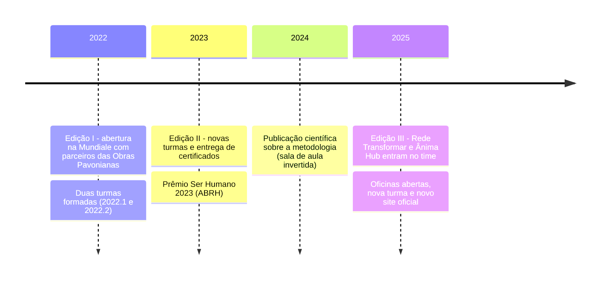
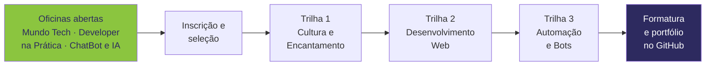

### #ProgramandoMudanças

**Formação de jovens programadores das comunidades de Belo Horizonte, em hard skills e soft skills.**

---

## Quem somos 

O **FavelaWare** é uma iniciativa voltada para a **formação de jovens programadores**, de 15 a 24 anos,
vindos dos aglomerados **Barragem Santa Lúcia, Morro do Papagaio, Vila São José, Conjunto Santa Maria,
Vila Leonina, Vila Estrela, Morro das Pedras e região**, em Belo Horizonte/MG.

O projeto é focado na formação técnica (lógica, low code, front end, back end, APIs e bots) e na
formação de soft skills (comunicação, desenvolvimento pessoal, trabalho em equipe), **com aulas
ministradas por especialistas** na área e acompanhamento psicológico em grupo.

O FavelaWare nasceu da união entre a **Mundiale**, o **Ecossistema Ânima Educação** (através da
**UNA Cristiano Machado**) e a **AOPA / Obras Pavonianas**, e hoje conta também com a **Rede Transformar**.

> **"Boas ideias sem ação é conversa de botequim."** - Gustavo Pena, idealizador

## Pilares ❤

- 📚 Incentivar o ingresso de jovens de comunidades na área da tecnologia da informação;
- 📚 Desenvolver competências e habilidades iniciais relacionadas à área;
- 📚 Apoiar a inclusão de jovens talentos no mercado de trabalho.

### Propósitos

| | |
|---|---|
| 🎓 **Acadêmico** | Proporcionar aos alunos de TI da UNA Cristiano Machado compartilhar as habilidades adquiridas nos cursos, atuando como instrutores e líderes discentes. |
| 🤝 **Social** | Gerar mudanças na realidade de jovens de comunidades vulneráveis. |
| 🚀 **Carreira** | Fornecer experiência prática, abrindo um novo caminho para o futuro da carreira em tecnologia. |

## Nossa história

|  |  |
|:---:|:---:|
| *Abertura do projeto com as professoras Samara, Rafaela, Tatiana e Iracema, os parceiros da Mundiale, das Obras Pavonianas e alunos - 2022* | *Formatura do projeto Favelaware na Mundiale - 2022* |

## Como fazemos

Cada edição segue **trilhas** com carga horária definida, do primeiro contato com o computador até a
construção de bots e integrações com APIs. Tudo com **sala de aula invertida**: o aluno estuda o
material, e o encontro é para praticar, tirar dúvidas e construir projeto.

| Trilha | Carga | O que o aluno aprende |
|---|:---:|---|
| **1ª - Cultura e Encantamento** | 60h | Carreira Tech · Inclusão: Mundo Digital · Pensamento Lógico · Git e GitHub · Softskills |
| **2ª - Desenvolvimento Web** | 152h | HTML · CSS · JavaScript · JavaScript para Web · Introdução Forge Chatbot e IA · Trabalhando com APIs |
| **3ª - Automação e Bots** | 36h | Blip / Forge · Automação · Web-crawlers · RPA · Desenvolvimento de bots |
| **Oficinas Softskills** | 15h | Currículo e LinkedIn · Mentalidade de crescimento · Entrevistas e networking · Pitch de projeto |
| **Bem-estar e saúde mental** | 15h | Oficinas em grupo e plantão psicológico com a equipe da AOPA |

Os repositórios desta organização guardam o que as turmas produzem: **entregas de atividades**,
**resoluções de exercícios**, **material de apoio** e o **site oficial**.

## Nossos números

| **150+** | **5+** | **3** | **7** |
|:---:|:---:|:---:|:---:|
| Alunos formados | Turmas | Edições | Comunidades atendidas |

## Reconhecimentos 🏆

- **Prêmio Ser Humano 2023** - [ABRH Brasil](https://www.abrhbrasil.org.br/psh/), reconhecendo o projeto
  como prática de gestão de pessoas com impacto social.
- **Publicação científica** - *Extension Project Based on Flipped Classroom to the Development of Hard
  and Soft Skills in Brazilian Outskirts: Case studies*.
  [doi.org/10.33422/ijsfle.v2i2.46](https://doi.org/10.33422/ijsfle.v2i2.46)

 

## Nossos valores

**Tecnologia como porta de entrada** - a favela também programa. · **Aprender fazendo** - projeto
real, portfólio real, GitHub real. · **Ninguém cresce sozinho** - alunos, instrutores discentes e
parceiros caminham juntos. · **Cuidado integral** - saúde mental e soft skills têm o mesmo peso do
código. · **Ação, não conversa** - boas ideias viram turma, aula e formatura.

## Parceiros

| | |
|---|---|
| **Ânima Hub** | Laboratório de inovação da Ânima, responsável pelo site oficial do projeto. |
| **AOPA - Obras Pavonianas** | Instituição social católica dos Religiosos Pavonianos, dedicada ao atendimento integral de crianças e adolescentes. |
| **Ecossistema Ânima Educação / UNA Cristiano Machado** | Uma das maiores organizações de ensino superior do Brasil, com cerca de 330 mil estudantes. De onde saem os instrutores e líderes discentes. |
| **Mundiale** | Empresa de canais digitais que une pessoas, tecnologia e metodologia própria para tornar a relação entre marcas e consumidores mais humana. Casa da abertura e das formaturas. |
| **Rede Transformar** | Organização sem fins lucrativos voltada à formação profissional em TIC e à garantia de direitos sociais. |

---

**A favela também programa. #ProgramandoMudanças**

📫 [favelaware@gmail.com](mailto:favelaware@gmail.com) · [favelaware.animahub.com.br](https://favelaware.animahub.com.br/home) · [@favelaware](https://instagram.com/favelaware) · Belo Horizonte, MG - Brasil

